Users are managed within the server dashboard by navigating to **Users**.

Once a local user account has been created, the first step should be to set and save a password for that account. See [Passwords](Passwords.md). Then you can come back and the customization outlined in this article.

## Emby Connect

You can link the local user account to an Emby Connect e-mail address. See [Emby Connect](Emby-Connect.md).

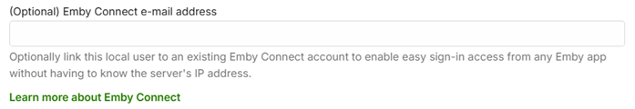

## Control Remote Access to the Emby Server

You can control remote connections to the server at the user level.

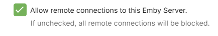

You can disable or hide a user, as well as lock them from changing their user profile settings.

## Disabling User

Disabling a user will do just that. All existing sessions from that user will be abruptly terminated.

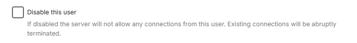

## Hiding User account name on Login Screens

Hiding a user will simply remove them from visual login screens. They will need to enter their username and password manually.

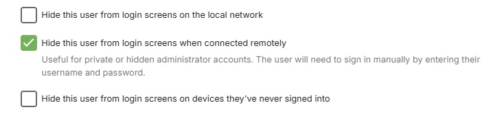

## Controlling user's ability to change password / add a profile image

The server administrator can disable the user's ability to change their password and profile image. Disabling this would remove the ability to edit the Profile in the list of User Preferences visible to the user. This is useful for administrators who prefer to dictate these terms to their users.

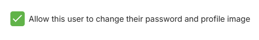

## Copying user preferences and settings from one user to other users

See [Copy User Settings](User-Copy-Settings.md)

## Feature Access

Features can be granted or denied, such as the ability to delete media, download media, view live tv, manage live tv, etc. The "Allow media playback" option determines if the user is able to play media or not. This option is handy if you'd like to setup a user who can browse the library but not play anything.

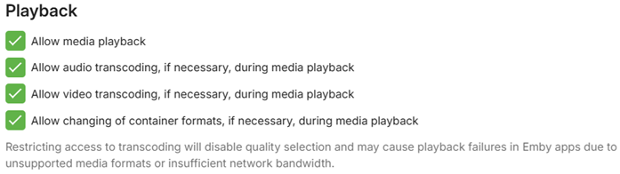

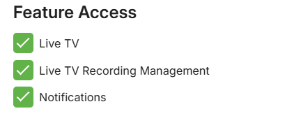

You can set a limit on the number of concurrent video streaming sessions for the user. Note that this requires [Emby Premiere](Emby-Premiere.md) for it to be enforced. 

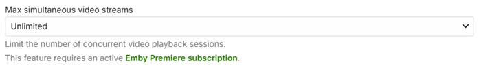

You can also limit the bandwidth per video streaming for devices away from the local network.

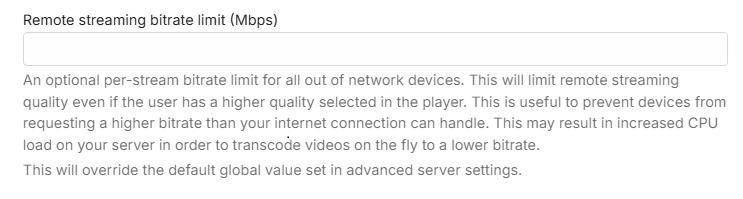

And in cases where the remote device has quality set to Auto, you can also put a bandwidth limit to override that.

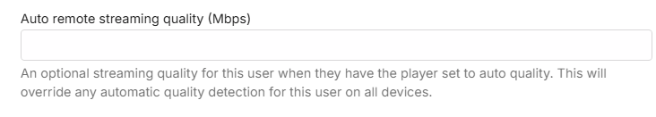

If you want to allow media deletions by the user, you can select from the list of libraries and channels.

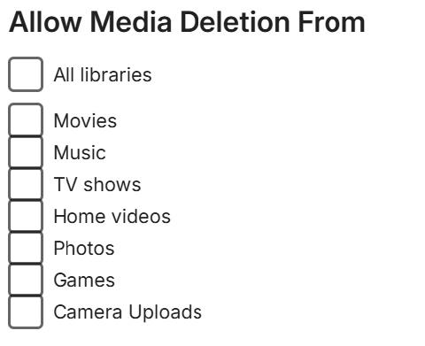

You can also decide how they can remote control shared devices. Remote controlling another user allows them to send content to devices for playback while another user is signed in. Remote controlling shared devices, such as Dlna devices, allows them to send content to those as well. These can be set now or later.

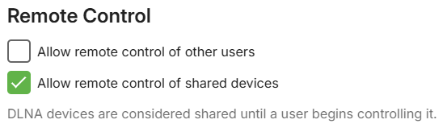

Other features can also be configured: Downloads, Subtitles, Camera Upload, Media Conversion, Sharing playlists and some limited media information sharing on social media.

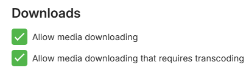

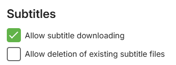

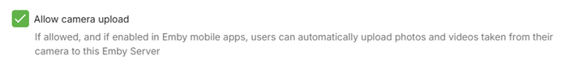

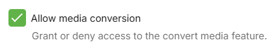

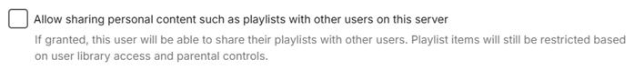

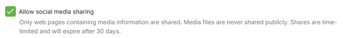

## User Profile and Preferences

See [User Preferences](User-Prefs.md).

## Content Access

See [Content Access](Content-Access.md).

## Device Access

See [Device Access](Device-Access.md).

## Parental Controls

See [Parental Controls](Parental-Controls.md).

## User Password

See [Passwords](Passwords.md).
