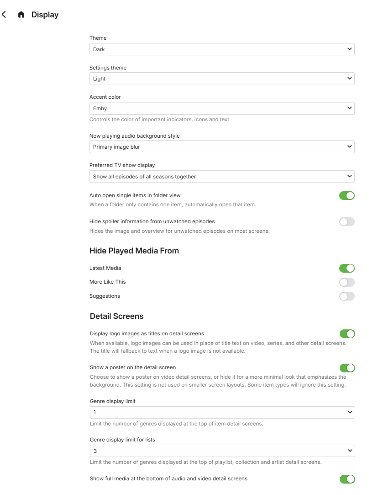

The **Display** user preferences cover the following:

## Display

* Theme
  * Apple TV
  * Black
  * Red Radiance
  * Dark
  * Light
  * Superman
  * Windows Media Center
* Settings Theme: Same as main theme or choice as above
* Color
  * Emby
  * Blue
  * Green
  * Pink
  * Purple
  * Red
* Now Playing audio background style
  * Backdrop
  * Primary image blur
* Preferred TV show display
  * Show all episodes of all seasons
  * Show all episodes of only single season shows
  * Always show season folders
* Auto open single items in folder view
* Hide Spoiler information from unwatched episodes

## Hide Played Media from

  * More Like This
  * Suggestions

* ## Details Screen

  * Display logo images as titles on details screens
  * Show a poster on the detail screen

* Genre display limit
* Genre display limit for lists
* Show full media at the bottom of audio and video detail screens

