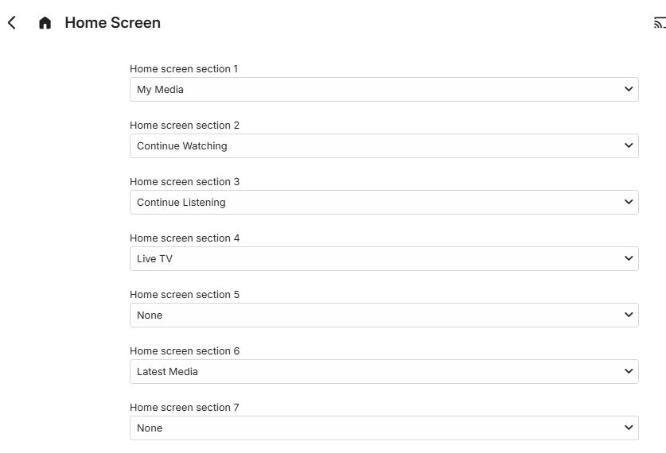
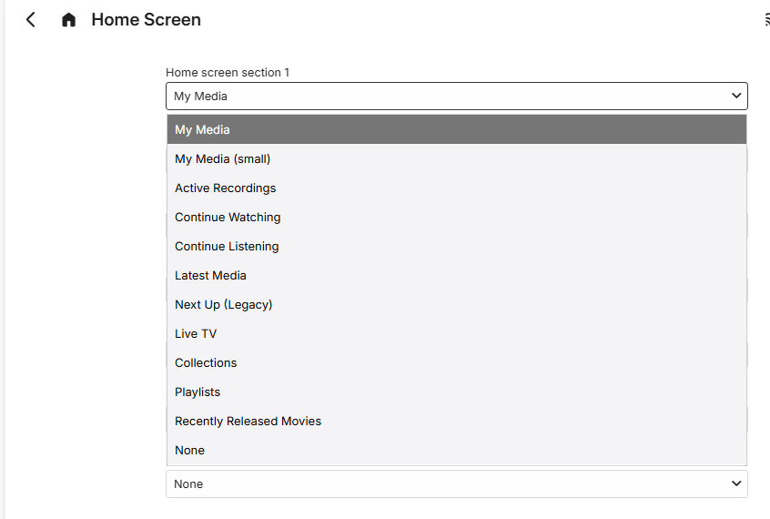
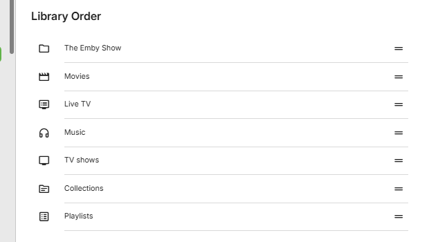
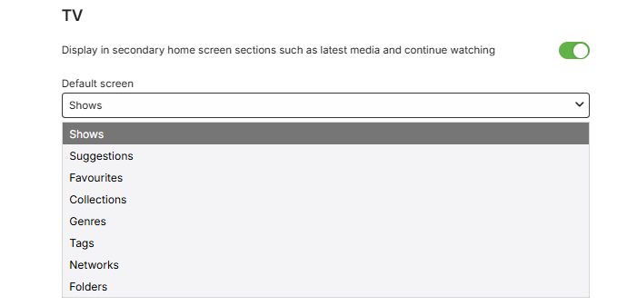

## Emby Server versions 4.8.x and 4.9.x

Up to 7 section types can be configured for the user's Home Screen, with the default being:

For each section, a drop-down is available to choose from:

This is followed by a list of the libraries to show the **Library Order**. Library positions can be changed by moving the rows around.

Below the library order list, each library is shown with a configurable option for inclusion in sections like **Latest Media** and **Continue Watching** and also an option for the default screen to be pre-selected when viewing the library. The following is an example of this for a TV Shows library, named **TV**:

## Related:
- [User Preferences - Home Screen](User-Prefs-HomeScreen.md)

