Users and the server administrator can customize the Home Screen content and as from Emby Server version 4.10.x, the functionality has been greatly enhanced to allow you to view your media grouped in the way you like.

This article covers the features introduced in Emby Server version 4.10.x onwards. For earlier versions of Emby Server (4.8.x and 4.9.x), refer to [User Preferences - Home Screen (Legacy)](User-Prefs-HomeScreen-Legacy.md).

There are very advanced and functionality rich options for customizing the users Home Screens introduced in Emby Server 4.10.x, giving you the ability to:

- Limit certain sections to specific libraries
- Choose the image that is used (poster/thumb)
- Override the scroll direction
- View recently released episodes / movies
- Create a home screen section based on a playlist, collection, genre, studio or tag.
- Having dynamic views based on extensive selection criteria with added option for a Spotlight view

> [!TIP]
> Server admin can replicate the Home Screen customization from one user account to other user accounts. Have a look at [Copy User Settings](User-Copy-Settings.md) once you have a configuration for one user account that you want to replicate.

The following shows the initial default **Home Screen** contents and preferences. See [Adding and customizing Home Screen sections](#adding-and-customizing-home-screen-sections) below for making changes.

## Default Home Screen Sections

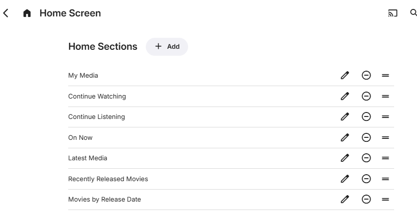

The order in which the libraries are shown is determined by the **Library Order** list that follows. Each library is listed and can be re-ordered by selecting the row and moving it up or down. Rows are also shown for **LiveTV** and installed additions such as **The Emby Show**.

In this example, **The Emby Show** plugin is installed and **LiveTV** has been configured and there is one library for each of **Movies**, **TV Shows**, **Music**, **Photos** and **Videos**.

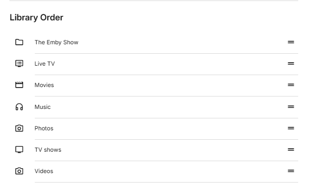

Below this, there are options for selecting the default screens for each.

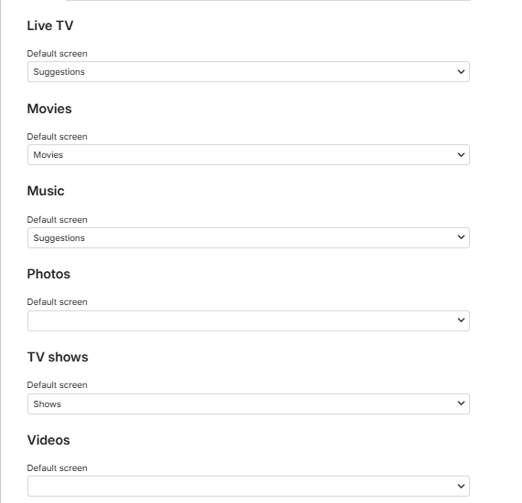

## Adding and customizing Home Screen sections

There is no limit on the number of sections to be added to the Home Screen. A section type can be added more than once with different selection and presentation options. The order the sections appear can be changed by selecting a row within the "**Home Sections**" settings page and dragging up or down. The following shows the various section types that can be added:

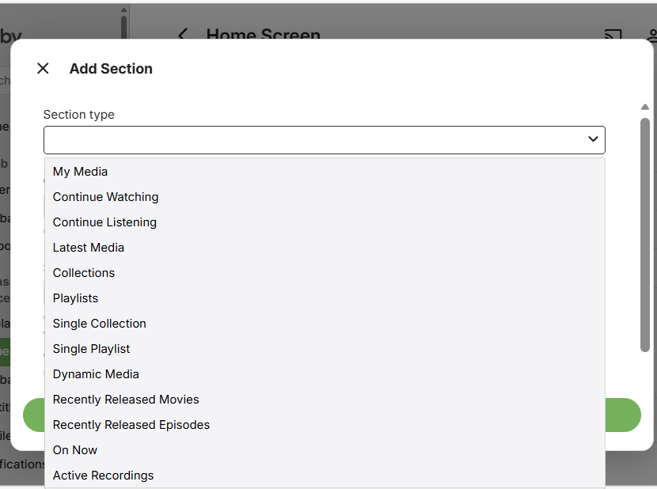

Some of the options that were available for Home Screen customization in previous versions of Emby Server, have now been moved and covered by the configuration options available when adding or editing a section.

For example, the old "**Next Up (Legacy)**" is no longer available as a section type but the options for "**Continue Watching**" will include one for "**Include next up episodes**".

Also libraries home screen preferences for inclusion in secondary home screen sections such as **Latest Media** and **Continue Watching** have been removed and equivalent functionality is now provided by having a library list to tick for each section.

With the variety of available options, you will see now that there may be more than one way to achieve what you like to see on the Home Screen.

See the [FAQ](#home-sections-faq) below for further information.

## Options for Home Sections

**Custom Title**

You have the option to specify a custom title for the sections for all but sections for the "Latest Media" section type. If the option is available and left blank, the title will be automatically generated. The Home section title appears above each section on the Home Screen, except when it is for a section with a Spotlight view type and it is the first section on the Home Screen. An example of this is shown in the [Home screen examples](#home-screen-examples) below.

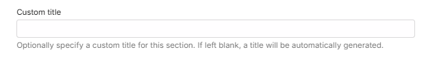

**Show This Section**

All section types have an option for always showing a Home Section or only when TV display mode is on or off. The default is always.

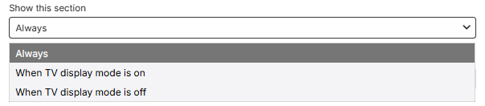

**View Type**

This could be a choice of **Cards** or **Buttons** as in the case of **"My Media"** section type or **Cards** and **Spotlight** for section types where a Spotlight view is available.

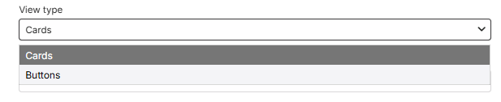

or

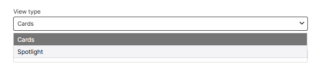

**Dynamic Media section media types option**

The Dynamic Media home section type allows you to create sections for specific media and metadata types: Movies, Shows, Movies & Shows, Episodes, Music Videos, Videos, Photos, Programs, Live TV Channels, Music Albums, Artists, Songs, Audio Books, Trailers, Games, Books.

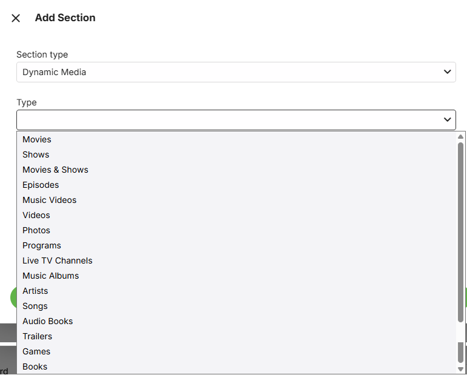

**Libraries**

A drop-down list of all libraries will be shown where you can exclude/include individual libraries. This list will also include components such as Live TV, Web Streams and IPTV. The default is all being included. Example:

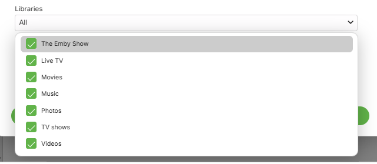

> [!NOTE]
> New libraries added to the server will get included in Home Sections where you had specific libraries selected. The Home Sections would need to be edited if a new library is to be excluded.
>

**Next Up episodes**

The **"Continue Watching"** Home Section has an option for including or excluding the Next Up episodes. Toggle the **"Include next up episodes in Continue Watching"** option to include or exclude Next up episodes.

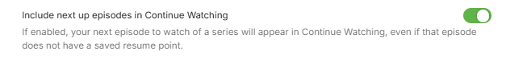

**Filters**

The following shows examples of filters that are available, depending on the section type or the media type for a **Dynamic Media** section type.

**Favorite and Tags filtering**

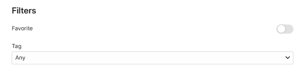

**Playstate filtering**

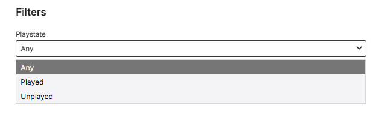

**Filter options for Studio and Genre**

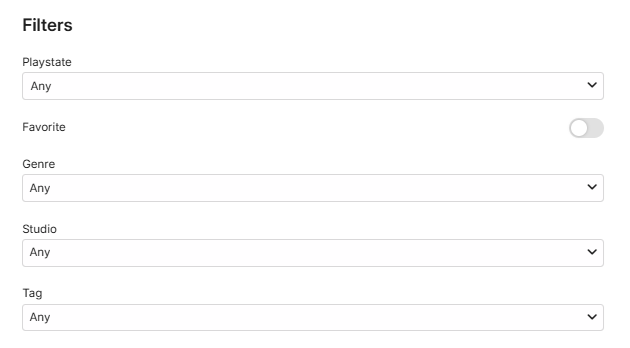

**Sort By** and **Sort Order**

Extensive list of sort options are provided with Ascending or Descending sort order.

Example:

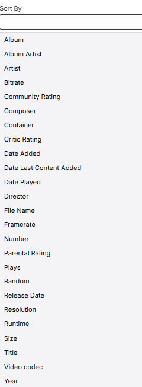

**Scroll Direction**

This will be a choice between **Auto** (the default) and **Horizontal** or **Vertical** to override apps scroll direction. When set to Auto, Emby apps will choose a scroll direction based on several factors such as screen size, orientation, form factor.

> [!NOTE]
> Forcing vertical scroll direction may result in the number of items shown being limited for performance reasons.

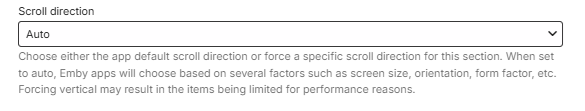

and options being:

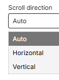

**Image Type**

This will be a choice between **Auto** (the default) and **Primary** or **Thumb** image.

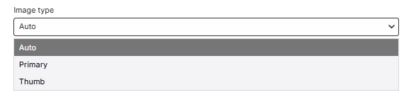

## Home Section Types Matrix

<table class="homesection-matrix-table">
    <thead>
    <tr>
        <th>
            Section Type
        </th>
        <th>Custom Sorting</th>
        <th>Libraries Selection</th>
        <th>Spotlight View</th>
		<th>Filters</th>
        <th>Play State Filtering</th>		
        <th>Image Type Option</th>
    </tr>
    </thead>
    <tbody>
    <tr>
        <td>My Media</td>
        <td>
            

        </td>
        <td>
            
✔

        </td>
        <td>
            

        </td>
        <td>
            

        </td>
        <td>
            

        </td>
        <td>
            

        </td>
    </tr>
    <tr>
        <td>Continue Watching</td>
        <td>
            

        </td>
        <td>
            
✔

        </td>
        <td>
            

        </td>
        <td>
            

        </td>
        <td>
            

        </td>
        <td>
            
✔

        </td>
    </tr>
    <tr>
        <td>Continue Listening</td>
        <td>
            

        </td>
        <td>
            
✔

        </td>
        <td>
            

        </td>
        <td>
            

        </td>
        <td>
            

        </td>
        <td>
            

        </td>
    </tr>
    <tr>
        <td>Latest Media</td>
        <td>
            

        </td>
        <td>
            
✔

        </td>
        <td>
            

        </td>
        <td>
            
✔

        </td>
        <td>
            
✔

        </td>
        <td>
            

        </td>
    </tr>
    <tr>
        <td>Collections</td>
        <td>
            
✔

        </td>
        <td>
            

        </td>
        <td>
            

        </td>
        <td>
            
✔

        </td>
        <td>
            

        </td>
        <td>
            
✔

        </td>
    </tr>
    <tr>
        <td>Playlists</td>
        <td>
            
✔

        </td>
        <td>
            

        </td>
        <td>
            

        </td>
        <td>
            
✔

        </td>
        <td>
            

        </td>
        <td>
            
✔

        </td>
    </tr>
    <tr>
        <td>Single Collection</td>
        <td>
            
✔

        </td>
        <td>
            
✔

        </td>
        <td>
            
✔

        </td>
        <td>
            

        </td>
        <td>
            

        </td>
        <td>
            
✔

        </td>
    </tr>
    <tr>
    <tr>
        <td>Single Playlist</td>
        <td>
            
✔

        </td>
        <td>
            
✔

        </td>
        <td>
            
✔

        </td>
        <td>
            
✔

        </td>
        <td>
            
✔

        </td>
        <td>
            
✔

        </td>
    </tr>
    <tr>
        <td>Dynamic Media</td>
        <td>
            
✔

        </td>
        <td>
            
✔

        </td>
        <td>
            
✔

        </td>
        <td>
            
✔

        </td>
        <td>
            
✔

        </td>
        <td>
            
✔

        </td>
    </tr>
    <tr>
        <td>Recently Released Movies</td>
        <td>
            

        </td>
        <td>
            
✔

        </td>
        <td>
            
✔

        </td>
        <td>
            
✔

        </td>
        <td>
            
✔

        </td>
        <td>
            
✔

        </td>
    <tr>
        <td>Recently Released Episodes</td>
        <td>
            

        </td>
        <td>
            
✔

        </td>
        <td>
            

        </td>
        <td>
            
✔

        </td>
        <td>
            
✔

        </td>
        <td>
            
✔

        </td>
    </tr>
    <tr>
        <td>On Now</td>
        <td>
            

        </td>
        <td>
            

        </td>
        <td>
            

        </td>
        <td>
            

        </td>
        <td>
            

        </td>
        <td>
            

        </td>
    </tr>
    <tr>
        <td>Active Recordings</td>
        <td>
            

			</td>
        <td>
            

        </td>
        <td>
            

        </td>
        <td>
            

        </td>
        <td>
            

        </td>
        <td>
            
✔

        </td>
    </tr>
    </tbody>
</table>

## Home Sections FAQ

[How many Home Sections can I have?](#how-many-home-sections-can-i-have)

[If I select libraries for a Home Section, what happens when new libraries are added?](#if-i-select-libraries-for-a-home-section-what-happens-when-new-libraries-are-added)

[Which Home Section types can display "Next-Up Episodes"?](#which-home-section-types-can-display-next-up-episodes)

[How do I create the "Next Up (Legacy)" Home section?](#how-do-i-create-the-next-up-legacy-home-section)

[Can I change the title of a Home Section?](#can-i-change-the-title-of-a-home-section)

[What is a Spotlight view ?](#what-is-a-spotlight-view-)

[Where do Channels, Live TV, Web Streams, IPTV etc fit in ?](#where-do-channels-live-tv-web-streams-iptv-etc-fit-in-)

[What filtering is available?](#what-filtering-is-available)

[What can I achieve with the "Dynamic Media" Home section type?](#what-can-i-achieve-with-the-dynamic-media-home-section-type)

[What is the "Continue Listening" section type for? I do not see my music there!](#what-is-the-continue-listening-section-type-for-i-do-not-see-my-music-there)

### How many Home Sections can I have?

There is no limit on the number of Home Sections you create and you can have multiple Home Sections of the same type. 

### If I select libraries for a Home Section, what happens when new libraries are added?

Any new libraries that are added will show in all Home Sections that have libraries selected. You would need to edit the Home Sections if you do not wish a new library to be included.

### Which Home Section types can display "Next-Up Episodes"?

You can create a **"Next-Up"** view by ticking that option in the **"Continue Watching"** Home Section type. 

### How do I create the "Next Up (Legacy)" Home section?

Add a **"Continue Watching"** Home Section, give it a custom time and ensure that the **"Include next up episodes in Continue Watching"** option is selected. 

If you have another **Continue Watching** Home section, you could untick that option for it or remove the section.

### Can I change the title of a Home Section?

With the exception of the "Latest Media" Home Section type, for all others you can specify a custom title for the Home Section.

> [!TIP]
> As an example you could split the view of your libraries using multiple "My Media" sections with different title. Furthermore, the "My Media" section type has view options of cards or buttons - so you can have some content showing with poster cards and some libraries in a different Home Section just having the  smaller buttons.
>

### What is a Spotlight view ?

The Spotlight view which is available on a number of Home Section Types (see the [Home Section Types Matrix](#home-section-types-matrix)) gives an impressive large poster for each media item. See examples shown below in [Home Screen Examples](#home-screen-examples).

### Where do Channels, Live TV, Web Streams, IPTV etc fit in ?

These are treated as libraries and would be available in the libraries selections list.

### What filtering is available?

This varies for Home Section Types. With the exception of the **"Latest Media"** section type, all sections that have filtering will have **Favourites** and **Tags** as filter options. Some section types will offer Genre and Studio filtering as well. See the [Home Section Types Matrix](#home-section-types-matrix) for the section types that have filtering on whether a media item has been played or not.

### What can I achieve with the "Dynamic Media" Home section type?

You can create a section for any of these types: Movies, Shows, Movies & Shows, Episodes, Music Videos, Videos, Photos, Programs, Live TV Channels, Music Albums, Artists, Songs, Audio Books, Trailers, Games, Books. You can select specific libraries and show the section as a Spotlight large poster view or the normal size poster cards view. Depending on the selected type, you have filter options, such as Tags, Genre, Favorites, Studio, playstate. The display can be sorted in many different ways.

### What is the "Continue Listening" section type for? I do not see my music there!

The "Continue Listening" section type is for Audio Books. That is why the music does not show.

## Home Screen Examples

Example of different **My Media** sections showing the main libraries as **cards** and others as **buttons**. In this example, there are five "My Media" sections with different libraries selected and a view type of Cards for the first three and buttons for the other two.

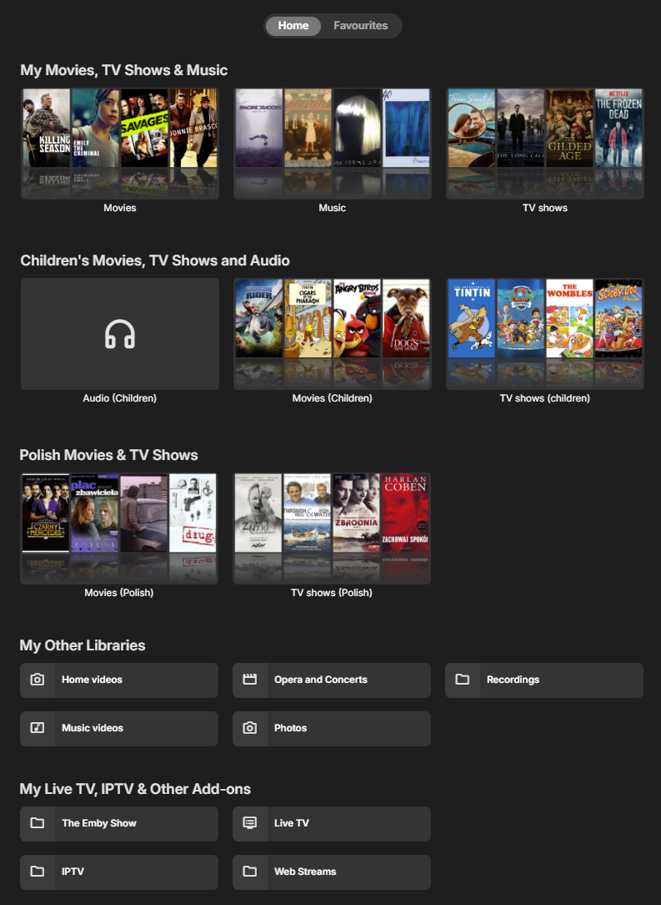

Example of a Single Collection Home Section:

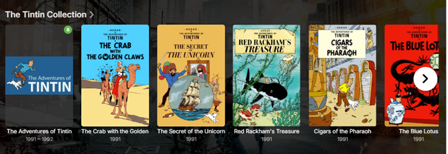

Example of a Single Playlist Home Section:

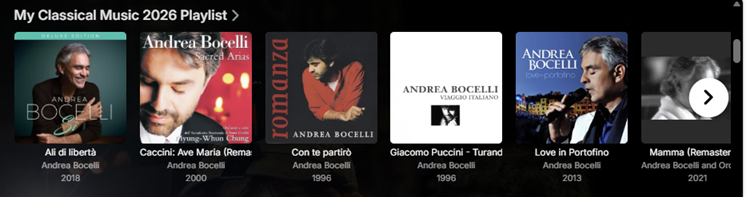

Example of "Recently Released Movies" section with Spotlight view where each movie shows with a large full screen poster.

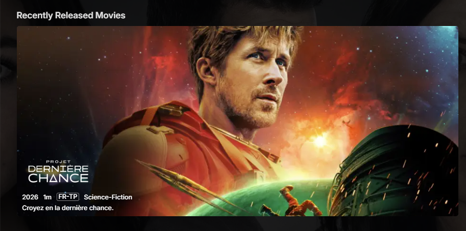

Example of a Dynamic view for Movies and Shows based on tags. In this example, created a tag "MyPicks" and assigned this tag to a number of Movies and TV Shows and created the dynamic view with a title of "This month's Picks" and filtering on this tag.

View type: Spotlight

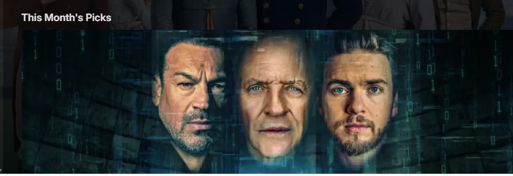

View type: Cards

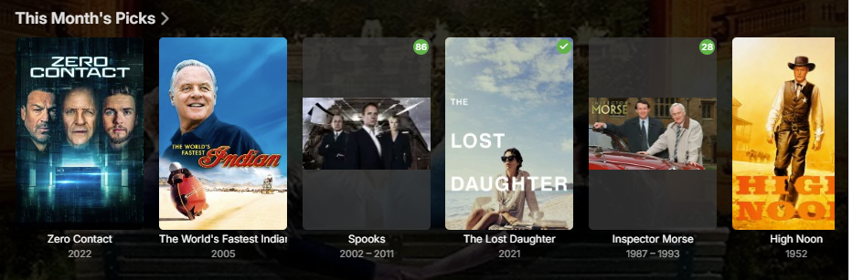

And here is an example for a Spotlight view of a dynamic media section filtered by a tag and is set as the first section on the Home Screen. When this is done, the section title does not show to give a nicer view for your Emby Server.

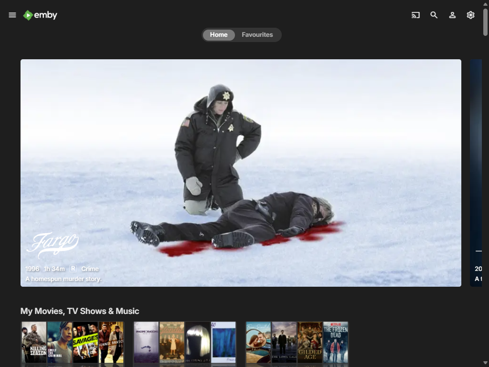

### Related:
- [User Preferences - Home Screen (Legacy)](User-Prefs-HomeScreen-Legacy.md)
