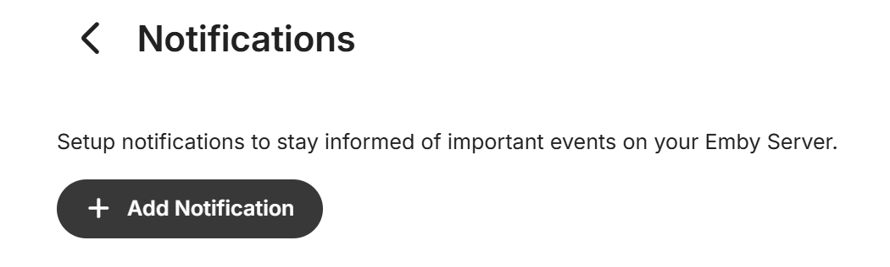
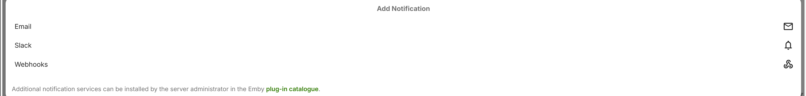
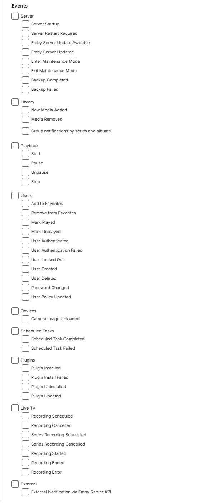
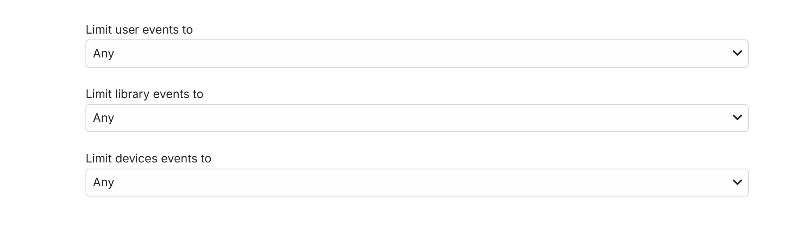

On the settings page, navigate to the User Account **Preferences** and clicking on **Notifications**. This will give you the option to **+ Add Notification** or edit an existing notification.

When selecting **+ Add Notification**, the page will display the available installed Plugins notifications services, as example when Email, Slack and Webhooks Plugins are installed:

To configure a notification, simply click on it. You'll then be taken to the notification configuration page. There are a number of ways notifications can be customized once the notification service specific configuration has been setup and tested.

The following gives the various notifications events that can be selected.

And you can limit the events using the drop-downs available for users, libraries and devices.

