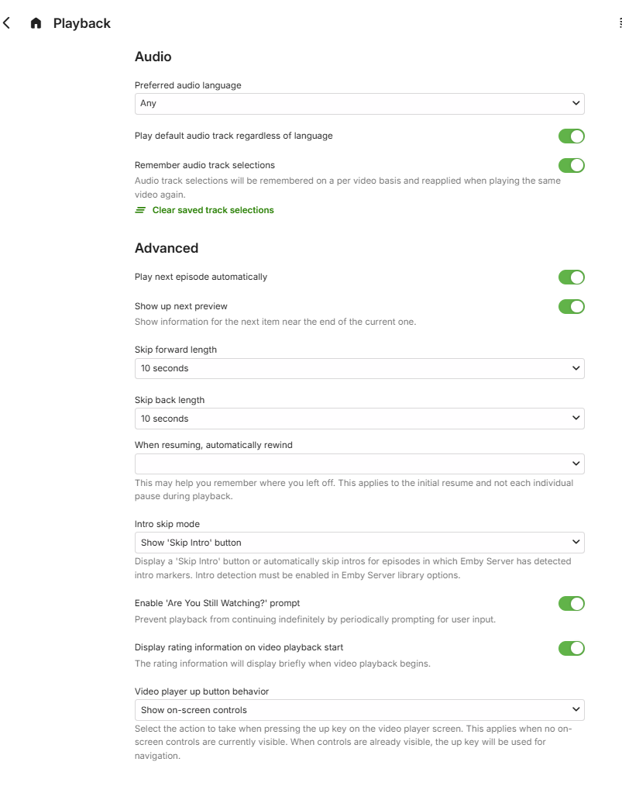

The **Playback** user preferences cover the following:

## Audio

  * Preferred audio language
  * Play default audio track regardless of language
  * Remember audio track selections

## Advanced

  * Play next episode automatically
  * Show up next preview
  * Skip forward length
  * Skip back length
  * When resuming automatically rewind x seconds
  * Intro Skip Mode
    * Show 'Skip Intro' button
    * Automatically skip intros
    * Off
  * Enable 'Are You Still Watching' prompt
  * Display rating information on video playback start
  * Video player up button behavior
    * Show on-screen controls
    * Chapters / Live TV Guide

