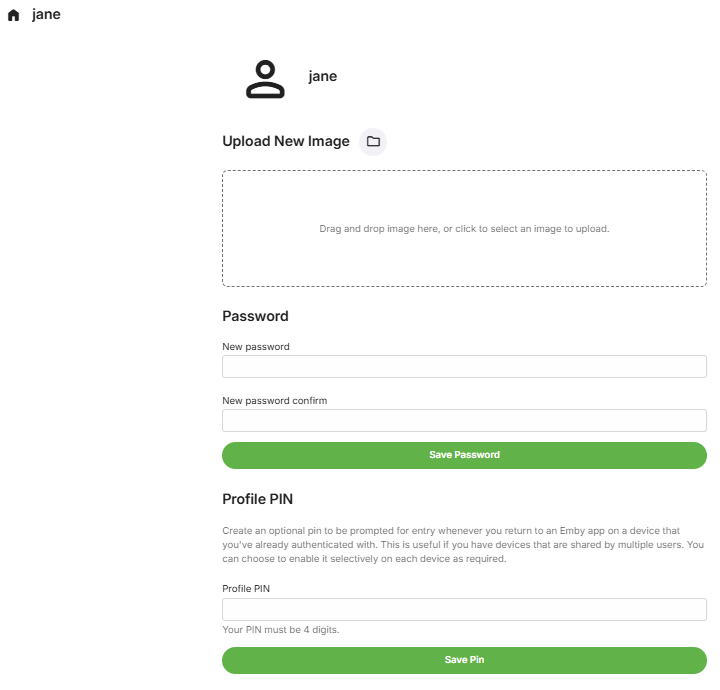

The Emby server administrator can edit the user profile preferences through server settings for Users, selecting the user and and on **Profile** tab, clicking the link labelled **Edit this user's profile, image and personal preferences** and then selecting **Profile**.

The administrator can also restrict or allow the user to upload a profile image and change the password and optional pin.

Users that have this locked down by the server administrator would not see this option for editing the **Profile** in the user preferences.

The **Profile** user preferences cover the following:

## Upload New Image

## Password

## Profile Pin

