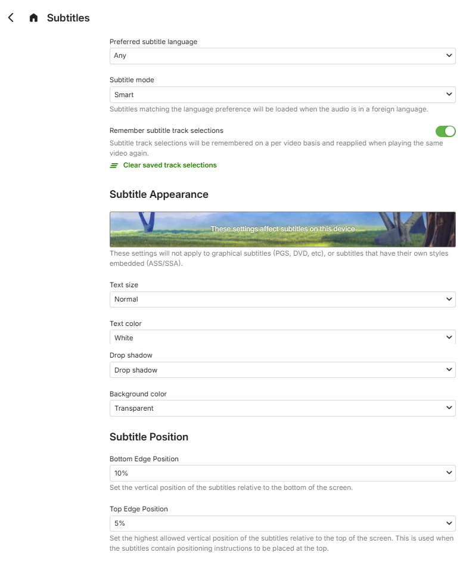

The **Subtitles** user preferences cover the following:

## Subtitles

* Preferred subtitle language
* Subtitle mode
  * Always play subtitles
  * Default
  * Smart
  * Only forced subtitles
  * Hearing impaired
  * No subtitles
* Remember subtitle track selections

## Subtitle Appearance

* Text size
* Text color
* Drop shadow
  * None
  * Raised
  * Depressed
  * Uniform
  * Drop shadow
* Background color

## Subtitle Position

* Bottom Edge Position  (x%)
* Top Edge Position (x%)

