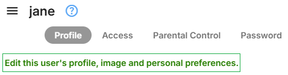
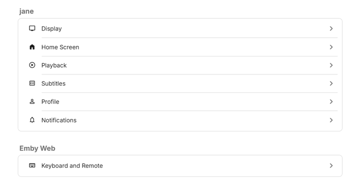

Users are managed within the server dashboard by navigating to **Users**.

## User Profile and Preferences

Preferences for the user account can be customized by the server administrator or the user. 

The server administrator can do this by selecting **Users** from the server settings dashboard and selecting the user account and on the **Profile** tab, clicking on the **Edit this user's profile, image and personal preferences**. 

The user can view and amend the user preferences by selecting **App Settings** and then selecting the user Preferences. Note that the server administrator may disable the ability for the user to edit the **Profile**. In which case, it would not appear in the list of Preferences.

### User Preferences

Please refer to the following documents for each of the Preferences:

### **[User Preferences - Display](User-Prefs-Display.md)**
### **[User Preferences - Home Screen](User-Prefs-HomeScreen.md)**
### **[User Preferences - Home Screen (Legacy)](User-Prefs-HomeScreen-Legacy.md)**
### **[User Preferences - Playback](User-Prefs-Playback.md)**
### **[User Preferences - Subtitles](User-Prefs-Subtitles.md)**
### **[User Preferences - Profile](User-Prefs-Profile.md)**
### **[User Preferences - Notifications](User-Prefs-Notifications.md)**

