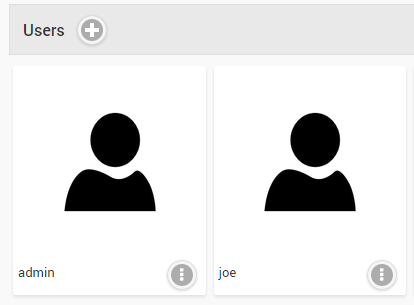
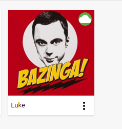
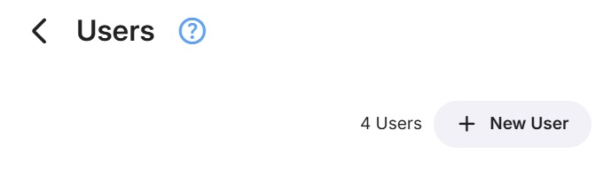
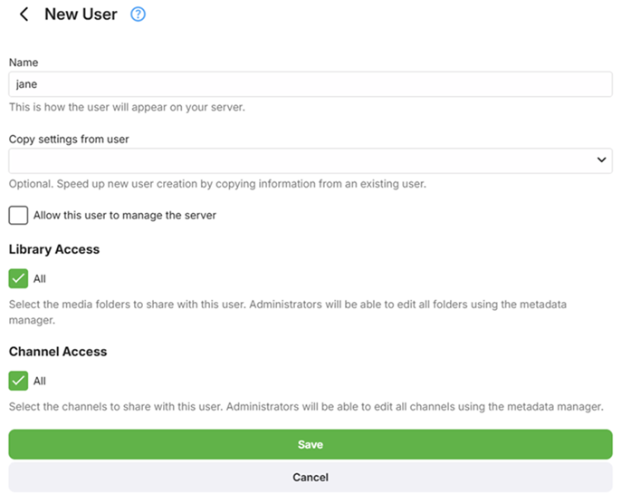
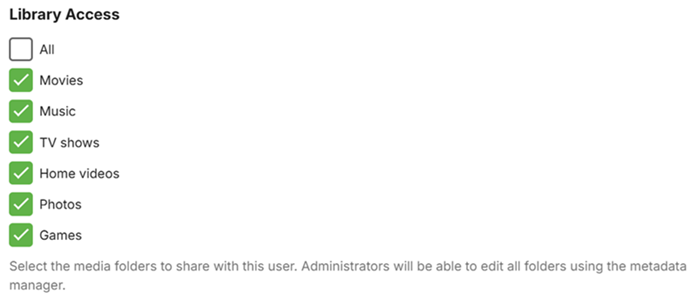
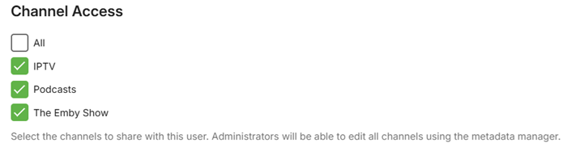
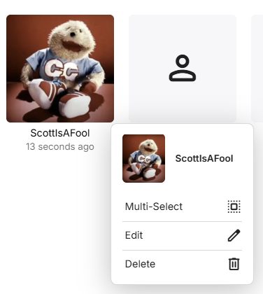

Most operations within Emby are based around users. Users can have their own personalized media libraries, user data, recommendations, security settings, and more.

Users are managed within the server dashboard by navigating to **Users**. 

## Local Users

Local users are displayed under the user heading. These are users that you've created in the server dashboard, and are privately managed within your personal Emby Server.

The Emby Server setup wizard will create a user with administrative access. This screen allows administrators to add, edit and remove additional users.

A local user will be displayed with a cloud if it is linked to [Emby Connect](Emby-Connect.md).

Linking a user to Emby Connect will enable an easier sign in process that doesn't require the user to know your server's ip address. For more information, see [Emby Connect](Emby-Connect.md).

## Adding a User

To add a user, click the + button within the Users heading:

You'll then be taken to the new user page page. The only required field is a user name. Whilst not recommended, any user can be granted administrative access which will allow them to utilize the server dashboard.

As you can see, settings and user preferences can be imported from another local user account. Functionality has also been added as from Emby Server 4.10.x to copy a user's preferences to other user accounts. See [Copy User Settings](User-Copy-Settings.md).

Before saving, you can configure library and channel access, and this can easily be changed later. Deselect **All** to select specific libraries and channels:

After saving, you will then be able to do more customization for this user account with the first recommended action being the setting of a user password.

> [!Important]
> Make sure you set user Password for the new account before you start to do any customization. See [Passwords](Passwords.md). 
> 

## User Customization

Please refer to [User Customization](User-Customization.md) for all the specific user preferences and feature access controls.

## Deleting a User

To delete a user, simply click the dot menu button and select **Delete**:

