Most operations within Emby are based around users. Users can have their own personalized media libraries, user data, recommendations, security settings, and more.

Users are managed within the server dashboard by navigating to **Users**. 

## Local Users

Local users are displayed under the user heading. These are users that you've created in the server dashboard, and are privately managed within your personal Emby Server.

The Emby Server setup wizard will create a user with administrative access. This screen allows administrators to add, edit and remove additional users.

A local user will be displayed with a cloud if it is linked to [Emby Connect](Emby-Connect.md).

Linking a user to Emby Connect will enable an easier sign in process that doesn't require the user to know your server's ip address. For more information, see [Emby Connect](Emby-Connect.md).

## Adding a User

To add a user, click the + button within the Users heading:

You'll then be taken to the new user page page. Any user can be granted administrative access which will allow them to utilize the server dashboard. The only required field is a user name:

Before saving, you can configure library and channel access, and this can easily be changed later. Deselect **All** to select specific libraries and channels:

After saving, you will then be able to do more customization for this user account.

You can link the local user account to an Emby Connect e-mail address. See [Emby Connect](Emby-Connect.md).

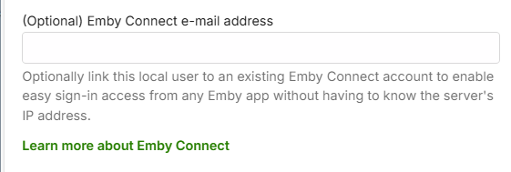

You can control remote connections to the server at the user level.

To manage user feature access, you can do this now or later by visiting the Users page and clicking on a user account. 

## Feature Access

Features can be granted or denied, such as the ability to delete media, download media, view live tv, manage live tv, etc. The "Allow media playback" option determines if the user is able to play media or not. This option is handy if you'd like to setup a user who can browse the library but not play anything.

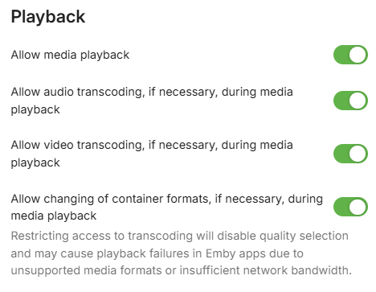

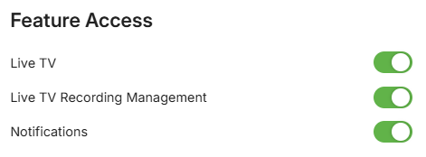

You can set a limit on the number of concurrent video streaming sessions for the user. Note that this requires [Emby Premiere](Emby-Premiere.md) for it to be enforced. 

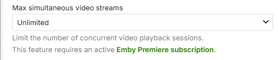

You can also limit the bandwidth per video streaming for devices away from the local network.

If you want to allow media deletions by the user, you cam select from the list of libraries and channels.

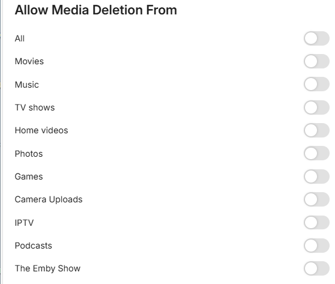

You can also decide how they can remote control shared devices. Remote controlling another user allows them to send content to devices for playback while another user is signed in. Remote controlling shared devices, such as Dlna devices, allows them to send content to those as well. These can be set now or later.

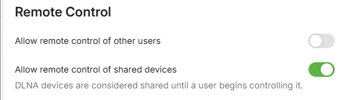

Other features can also be configured now or later. These cover Downloads, Subtitles, Camera Upload, Media Conversion, Sharing playlists and some limited media information sharing on social media.

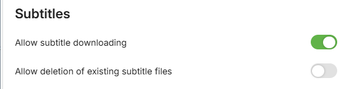

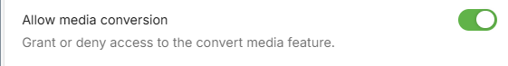

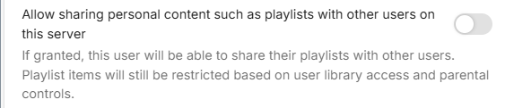

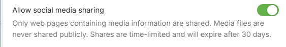

Lastly, you can disable or hide a user, as well as lock them from changing their user profile settings.

Disabling a user will do just that. All existing sessions from that user will be abruptly terminated.

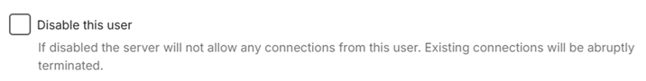

 Hiding a user will simply remove them from visual login screens. They will need to enter their username and password manually.

Disabling user preference access will prevent a user from changing their profile settings, such as their image, password, view preferences, language preferences, and more. This is useful for administrators who prefer to dictate these terms to their users.

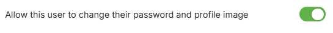

## User Profile and Preferences

These can be set now or later, through the link "Edit this user's profile, image and personal preferences@.

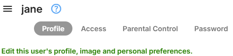

The link takes you to the following screen which is the same screen that the user gets on selecting App Settings, if granted permission to edit the profile and preferences.

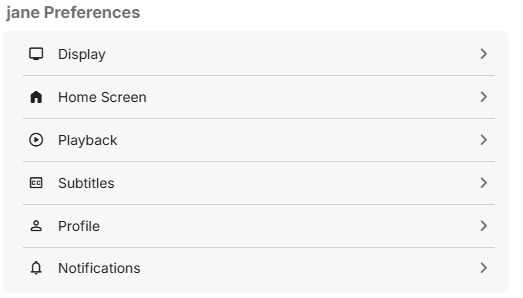

Clicking on the Profile button would allow upload of a profile image.

## Content Access

See [Content Access](Content-Access.md).

## Device Access

See [Device Access](Device-Access.md).

## Parental Controls

See [Parental Controls](Parental-Controls.md).

## User Password

See [Passwords](Passwords.md).

## Deleting a User

To delete a user, simply click the dot menu button and select Delete:

