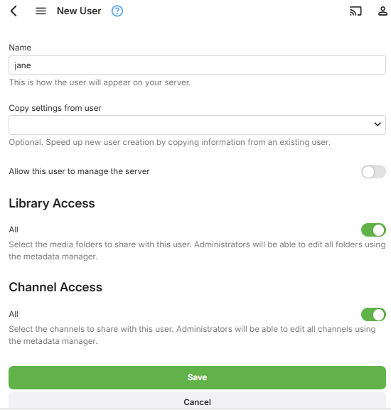

Most operations within Emby are based around users. Users can have their own personalized media libraries, user data, recommendations, security settings, and more.

Users are managed within the server dashboard by navigating to **Users**. 

## Local Users

Local users are displayed under the user heading. These are users that you've created in the server dashboard, and are privately managed within your personal Emby Server.

The Emby Server setup wizard will create a user with administrative access. This screen allows administrators to add, edit and remove additional users.

A local user will be displayed with a cloud if it is linked to [Emby Connect](Emby-Connect). 

Linking a user to Emby Connect will enable an easier sign in process that doesn't require the user to know your server's ip address. For more information, see [Emby Connect](Emby-Connect).

## Adding a User

To add a user, click the + button within the Users heading:

You'll then be taken to the new user page page. The only required field is a user name:

In addition you can also configure library and channel access, and this can easily be changed later:

## Feature Access

To manage user feature access, start by visiting the Users page and clicking on a user account. 

Any user can be granted administrative access which will allow them to utilize the server dashboard.

Other features can also be granted or denied, such as the ability to delete media, sync media, view live tv, manage live tv, etc. The "Allow media playback" option determines if the user is able to play media or not. This option is handy if you'd like to setup a user who can browse the library but not play anything.

You can also decide how they can remote control shared devices. Remote controlling another user allows them to send content to devices for playback while another user is signed in. 

Remote controlling shared devices, such as Dlna devices, allows them to send content to those as well.

Lastly, advanced access will give you the ability to disable or hide a user, as well as lock them from changing their user profile settings.

Disabling a user will do just that. All existing sessions from that user will be abruptly terminated. Hiding a user will simply remove them from visual login screens. They will need to enter their username and password manually.

Disabling user preference access will prevent a user from changing their profile settings, such as their image, password, view preferences, language preferences, and more. This is useful for administrators who prefer to dictate these terms to their users.

## Content Access

See [Content Access](Content-Access).

## Device Access

See [Device Access](Device-Access).

## Parental Controls

See [Parental Controls](Parental-controls).

## User Password

See [Passwords](Passwords).

## Deleting a User

To delete a user, simply click the dot menu button and select Delete:

