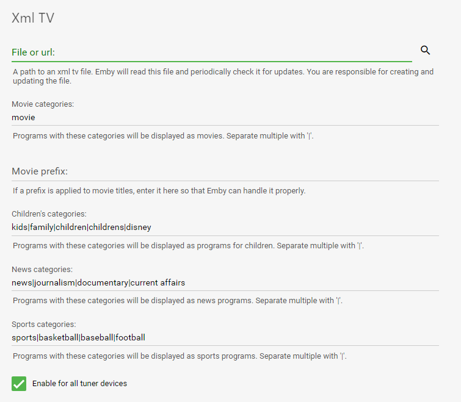

Emby supports Xml TV as a guide data source. To add Xml TV guide data, add a guide provider on the Live TV setup screen, and select "Xml TV".

On the Xml TV setup screen, you need to enter the path to your Xml TV. Emby will accept either:
* A path to an XML TV file
* A url to ax XML TV file that can be downloaded

XML TV uses categories to indicate types of programs. You can configure these categories in Emby to allow certain programs to appear as movies, sports, kid's programs, etc.

Additionally, you can also configure which tuners will use this guide data source. Emby allows you to add as many tuners and guide data sources as you like, and you can choose which the data source for each tuner.