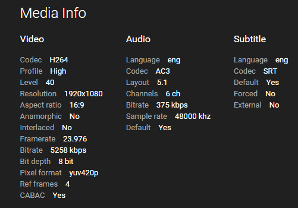

Emby apps play files directly wherever they can, and avoid transcoding. It happens only when the file is
not natively supported by the device you are playing on, or when the content's bitrate is higher than the
app's bitrate setting allows.

There are three things to check, in order.

## Is the Format Supported by the App?

Compare the media's format against what the app supports. The media info is shown at the bottom of the
detail page in Emby Web:

If the file is not natively supported, transcoding is required. Which formats each app supports natively
is documented per app:

- [Amazon Fire TV](../../Fire-TV.md)
- [Android Mobile](../../Android-Mobile.md)
- [Android TV](../../Android-TV.md)
- [Chromecast](../../Chromecast.md)
- [iOS](../../iOS.md)
- [Roku](../../Roku.md)
- [Web Client](../../Web-Client.md)

## Is the Bitrate Higher Than the App Allows?

Compare the file's bitrate, from the same media info, against the app's bitrate setting. If the file is
higher, transcoding is required.

Raising the app's bitrate setting can avoid this, but it will hurt playback if the network connection
cannot sustain it. Leaving the setting on Auto gives the best results for most people.

## Are Subtitles Selected?

Selected subtitles can trigger transcoding when the app does not natively support that subtitle format.
Most Emby apps handle text-based subtitles such as SRT and VTT natively. Graphical formats such as PGS and
VobSub are far more likely to force transcoding, because they usually have to be burned into the video -
which is also expensive in CPU terms, see
[Troubleshooting](Troubleshooting.md#high-cpu-usage-despite-hardware-acceleration).

## Reporting Unexpected Transcoding

If your files should not be transcoding and none of the above explains it, report it in the
[Emby Community](http://emby.media/community/). Start with a single example, and include:

- A copy of the media info from Emby Web
- The Emby Server log covering the time you played the content
- The transcoding log from the same time, if there is one

Logs are reachable in the server dashboard under **Help** -> **Logs**.
